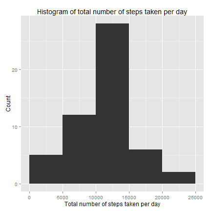
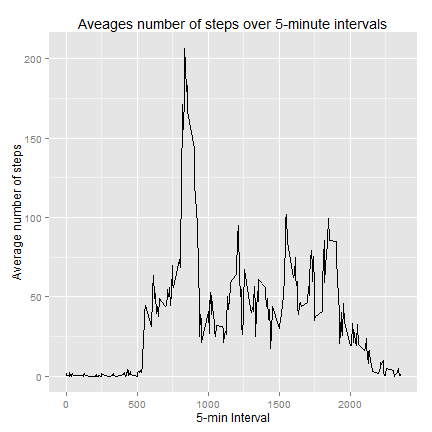
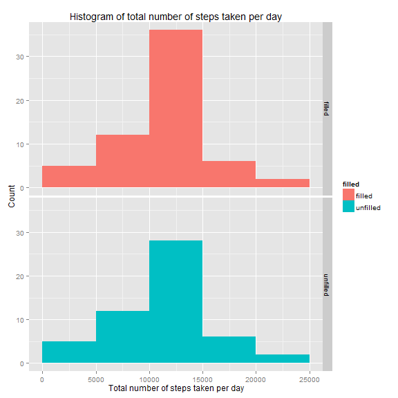
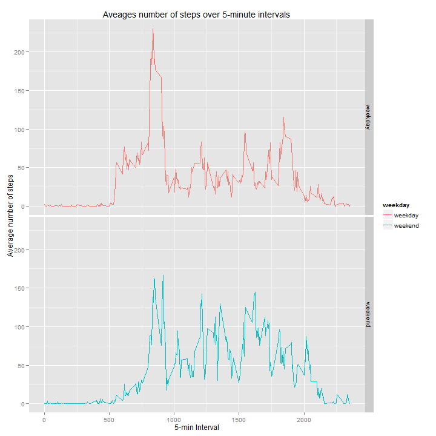

Reproducible Research Project 1
========================================================
## Introduction
This project analyzes data from a personal acitivy monitoring device that collects data at 5 minute intervals through out the day. The data consists of two months of data from an anonymous individual collected during the months of October and November, 2012 and include the number of steps taken in 5 minute intervals each day.

### Questions to be addresed are as follows:
1. Mean total number of steps taken per day.
2. Average daily activeity pattern
3. Replace missing values
4. Compare activity patterns between weekdays and weekends

### Data processing:

First, load the data,and  convert interval column into factor class.

```r
repdata = read.csv("activity.csv")
repdata = transform(repdata, interval = as.factor(interval))
```


Then prepare a new dataset for the first two questions, in which NA values are removed:

```r
library("ggplot2")
data = repdata[!is.na(repdata$steps), ]
```


### Plotting:
#### 1. Mean total number of steps taken per day
First, calculate total number of steps taken per day:

```r
dsteps = data.frame(avesteps = tapply(data$steps, factor(data$date), sum), date = levels(factor(data$date)))
```


Then plot histogram:

```r
p = ggplot(dsteps, aes(x = avesteps))
p = p + geom_histogram(binwidth = 5000)
p = p + labs(title = "Histogram of total number of steps taken per day", x = "Total number of steps taken per day", 
    y = "Count")
p = p + scale_x_continuous(limits = c(0, 25000))
print(p)
```

 


At last, calculate and report **mean** and **median** total number of steps taken per day:

```r
print(paste("Mean total number of steps taken per day is", sprintf("%.3f", mean(dsteps$avesteps)), 
    "and median is", median(dsteps$avesteps)))
```

```
## [1] "Mean total number of steps taken per day is 10766.189 and median is 10765"
```


#### 2. Average daily activeity pattern 
First, calculate average number of steps taken at 5-min intervals across all days:

```r
idata = data.frame(avesteps = tapply(data$steps, factor(data$interval), mean), 
    interval = as.integer(levels(factor(data$interval))))
```


Then make a time series plot:

```r
q = ggplot(idata, aes(x = interval, y = avesteps))
q = q + geom_line()
q = q + labs(title = "Aveages number of steps over 5-minute intervals", x = "5-min Interval", 
    y = "Average number of steps")
print(q)
```

 


Finally, report the time interval that contains the max number of steps:

```r
print(paste("The", idata[match(max(idata$avesteps), idata$avesteps), "interval"], 
    "5-minute time interval contains the max number of steps:", sprintf("%.3f", 
        max(idata$avesteps))))
```

```
## [1] "The 835 5-minute time interval contains the max number of steps: 206.170"
```


#### 3.Replace missing values
First, calculate number of missing values in the dataset with is.na function:

```r
nalist = is.na(repdata$steps)
print(paste("Total number of missing values in the dataset is:", sum(nalist)))
```

```
## [1] "Total number of missing values in the dataset is: 2304"
```


Next, fill the missing values with their corresponding 5-minute-interval mean steps:

```r
for (i in seq_along(nalist)) {
    if (nalist[i]) {
        repdata[i, "steps"] = idata[idata$interval == repdata[i, "interval"], 
            "avesteps"]
    }
}
```


Then, calculate total number of steps taken each day, make a histogram, and report mean and median:

```r
dnsteps = data.frame(avesteps = tapply(repdata$steps, factor(repdata$date), 
    sum), date = levels(factor(repdata$date)), filled = "filled")
dsteps$filled = "unfilled"
dnsteps = rbind(dnsteps, dsteps)

p = ggplot(dnsteps, aes(x = avesteps, fill = filled))
p = p + geom_histogram(binwidth = 5000)
p = p + facet_grid(filled ~ .)
p = p + labs(title = "Histogram of total number of steps taken per day", x = "Total number of steps taken per day", 
    y = "Count")
p = p + scale_x_continuous(limits = c(0, 25000))
print(p)
```

 

```r

print(paste("Mean and median total number of steps taken per day are", sprintf("%.3f", 
    mean(dnsteps$avesteps)), "and", sprintf("%.3f", median(dnsteps$avesteps)), 
    ",respectively"))
```

```
## [1] "Mean and median total number of steps taken per day are 10766.189 and 10766.189 ,respectively"
```

```r

print(paste("These values were", sprintf("%.3f", mean(dsteps$avesteps)), "and", 
    median(dsteps$avesteps), ",respectively"))
```

```
## [1] "These values were 10766.189 and 10765 ,respectively"
```

```r

print("An increase in median value results from input of missing values, while mean value does not change.")
```

```
## [1] "An increase in median value results from input of missing values, while mean value does not change."
```


#### 4.Compare activity patterns between weekdays and weekends
First, add a weekday/weekend factor variable into the dataset with NA filled:

```r
for (i in seq_along(repdata$date)) {
    weekday = weekdays(strptime(repdata$date[i], "%F"), TRUE)
    if ((weekday == "Sat") | (weekday == "Sun")) {
        repdata[i, "weekday"] = "weekend"
    } else {
        repdata[i, "weekday"] = "weekday"
    }
}
```

Next, calculate average number of steps taken for 5-min intervals of all weekdays or weekends:

```r
widata = data.frame(step = numeric(0), inteval = numeric(0), weekday = numeric(0))
wedata = split(repdata, repdata$weekday)
for (i in seq_along(wedata)) {
    avedata = data.frame(step = tapply(wedata[[i]]$steps, factor(wedata[[i]]$interval), 
        mean), interval = as.integer(levels(factor(wedata[[i]]$interval))))
    avedata$weekday = wedata[[i]]$weekday[1]
    widata = rbind(widata, avedata)
}
```


At last, make the time series plot for activity pattern:

```r
q = ggplot(widata, aes(x = interval, y = step))
q = q + geom_line(aes(col = weekday))
q = q + labs(title = "Aveages number of steps over 5-minute intervals", x = "5-min Interval", 
    y = "Average number of steps")
q = q + facet_grid(weekday ~ .)
print(q)
```

 

